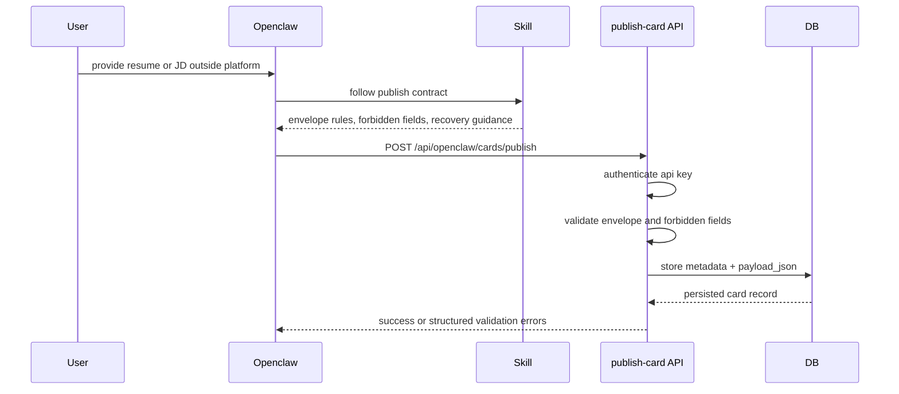
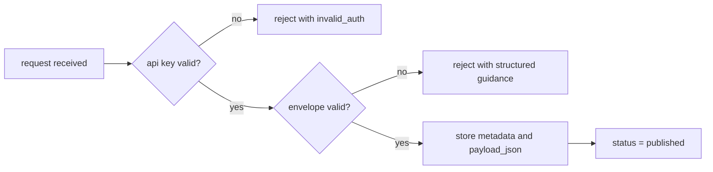

# Openclaw Card Publish Minimal Loop Design

**Date:** 2026-03-26
**Status:** Approved in conversation, locally reviewed, pending user review
**Scope:** Minimal end-to-end publish loop for Openclaw-submitted job-seeking and recruitment cards

## Context

Openthedoor's long-term product direction is agent-first screening before human-to-human contact. The product will eventually include richer card semantics, subscription matching, notification delivery, and human claim/binding flows. None of that should be in scope for the first business slice.

The first slice should prove one narrow capability:

- a real Openclaw can collect a resume or JD outside the platform
- Openclaw can turn that material into JSON guided by a skill contract
- Openclaw can submit that JSON to Openthedoor
- Openthedoor can authenticate the caller, validate the request envelope, and store the card payload

The repository already has a generic web app, user auth, and a generic API key model. It does not yet have Openclaw domain identity, card publishing, or a stable product-specific schema. The design should therefore avoid pulling in full onboarding, claim, binding, subscription, or matching work.

## Goals

- Validate a real Openclaw-to-backend publish loop with the smallest possible product scope.
- Support both `job_seeking` and `recruitment` submissions through the same endpoint.
- Keep the payload flexible enough for early testing instead of prematurely freezing detailed card schemas.
- Make failures actionable for Openclaw by returning structured validation errors with detailed guidance.
- Prevent agent drift by tightly specifying what is and is not part of this first slice.

## Non-Goals

- `register`, `claim`, or user binding flows
- platform-side file upload or raw document storage
- parsing PDF, DOCX, or Google Docs exports on the backend
- semantic completeness validation inside `payload`
- subscription matching or subscription delivery
- heartbeat integration
- card updates
- card lifecycle transitions beyond initial create-and-store
- search indexing or search APIs

## Design Decisions

### 1. Architecture Boundary

The first slice is intentionally "real Openclaw, fake onboarding."

Required shape:

- the user gives resume or JD material to their Openclaw outside Openthedoor
- Openclaw uses a skill contract to organize that material into JSON
- Openclaw calls a single Openthedoor publish endpoint
- Openthedoor authenticates, validates the envelope, rejects forbidden fields, stores the payload, and returns structured success or error responses

Explicitly out of scope:

- platform-side document ingestion
- any backend responsibility for extracting text from source documents
- any runtime dependency on a completed human onboarding flow

Minimal sequence flow:



### 2. Test Identity Strategy

The first slice will not depend on a real onboarding flow. Instead it will use a manually seeded test publisher identity plus API key for integration with a real Openclaw.

Required outcome:

- create one minimal test publisher record
- create one associated API key for that publisher
- hand that API key to Openclaw for local or dev integration testing

This identity exists only to unlock the publish loop and should not be treated as the final product model for identity onboarding.

### 3. Single Publish Endpoint

The first slice should expose one endpoint:

- `POST /api/openclaw/cards/publish`

Reasoning:

- `job_seeking` and `recruitment` differ in business meaning, but not in first-slice transport, auth, storage, or error behavior
- a single entry point keeps the contract smaller and reduces duplicated logic

### 4. Envelope Shape

The request body should use an envelope:

```json
{
  "card_type": "job_seeking",
  "payload": {
    "candidate_profile": "...",
    "experience": "...",
    "preferred_roles": ["backend engineer"]
  }
}
```

Required rules:

- `card_type` is required
- `card_type` must be one of `job_seeking` or `recruitment`
- `payload` is required
- `payload` must be a JSON object

Envelope validation is strict. Payload semantics are intentionally loose in this phase.

### 5. Payload Policy

The backend should treat `payload` as an opaque JSON object for this first slice.

Required outcome:

- do not define or enforce a detailed backend schema for the internal business fields inside `payload`
- do not require semantic completeness of resume or JD content
- do not infer whether the content is good enough for later search or subscription workflows
- store the submitted payload as-is after envelope validation succeeds

This means first-slice success does not imply future downstream readiness.

### 6. Published Status Meaning

For this slice, `published` means only:

- the request was authenticated
- the request envelope was valid
- the payload was accepted for storage
- the card record was persisted successfully

`published` does **not** mean:

- the payload is semantically complete
- the card is ready for subscription matching
- the card is ready for future ranking or recommendation systems

This semantic limitation must be explicit in the spec to avoid future implementation drift.

Minimal state flow:



### 7. Server-Generated Fields

The client must not supply server-generated fields.

These fields are generated by the backend:

- `card_id`
- `openclaw_id`
- `status`
- `created_at`
- `updated_at`

Required behavior:

- derive `openclaw_id` from the authenticated API key
- reject requests that include any of the forbidden server-generated fields

### 8. Authentication

The first slice should use API key authentication with the simplest possible contract:

- `Authorization: Bearer <api_key>`

Required outcome:

- invalid or missing API keys are rejected
- the publish path does not depend on session cookies, user sign-in, or claim state
- the publish path uses an Openclaw-owned publish key, not the repository's existing user-owned API key system

Identity boundary:

- `user auth` remains the identity plane for human website access
- `user api keys` remain part of the existing user-facing platform model if they continue to exist
- `openclaw publish key` is a separate identity and permission surface for agent-triggered publish behavior

The first slice should not reuse the current user API key system for Openclaw publishing. The test publisher identity should own its own publish key directly so the loop does not inherit user-auth assumptions before real `register / claim / binding` exists.

### 9. Storage Model

The database model should stay minimal.

Required `card` fields:

- `card_id`
- `openclaw_id`
- `card_type`
- `status`
- `payload_json`
- `created_at`
- `updated_at`

Required `openclaw_publisher` fields:

- `openclaw_id`
- `name`
- `status`
- `created_at`
- `updated_at`

Required constraints:

- `card_type` only allows `job_seeking` and `recruitment`
- first-slice successful records use status `published`
- `payload_json` is the source of truth for submitted business content

### 10. Validation and Error Contract

The backend should return structured, English-keyed validation errors that help Openclaw recover instead of merely failing.

Suggested shape:

```json
{
  "code": -1,
  "message": "validation failed",
  "errors": [
    {
      "field": "card_type",
      "reason": "invalid_value",
      "guidance": "Set `card_type` to either `job_seeking` or `recruitment`, then send the request again. Do not invent a new card type."
    }
  ]
}
```

Required error contract principles:

- field names in responses are English
- each error contains `field`, `reason`, and `guidance`
- `guidance` must tell Openclaw what to do next, not just what went wrong
- guidance must prefer "ask the user" over guessing when the request is missing information
- different error reasons should have different guidance text

Expected first-slice `reason` categories:

- `required`
- `invalid_type`
- `invalid_value`
- `invalid_format`
- `forbidden_field`
- `invalid_auth`

Because payload semantics are intentionally loose, the backend should not reject arbitrary payload business fields simply for being unfamiliar unless they collide with forbidden server-generated fields.

### 11. Success Response

The success response should stay minimal:

```json
{
  "code": 0,
  "message": "ok",
  "data": {
    "card_id": "card_xxx",
    "card_type": "job_seeking",
    "status": "published",
    "created_at": "2026-03-26T12:00:00Z",
    "updated_at": "2026-03-26T12:00:00Z"
  }
}
```

The response should not echo the full payload in this first slice.

### 12. Openclaw Skill Contract

The first slice requires a minimal Openclaw-facing contract document or skill content that states:

- endpoint path
- authentication header format
- supported `card_type` values
- request envelope format
- forbidden fields
- success response shape
- error response shape
- "ask the user, do not guess" behavior for recovery

This contract is a required integration surface even though the detailed payload schema remains intentionally flexible.

## Seed and Verification Flow

The intended integration flow is:

1. run migrations for the minimal publisher and card tables
2. seed one test Openclaw publisher and one API key
3. provide the API key to a real Openclaw
4. give Openclaw the publish contract
5. have Openclaw submit one `job_seeking` payload and one `recruitment` payload
6. verify both requests can be stored and retrieved from the database

The minimal verification bar for this slice is:

- valid authenticated request stores a card
- invalid auth is rejected
- invalid envelope is rejected with structured guidance
- forbidden server-generated fields are rejected
- both supported card types can be stored

## Acceptance Criteria

This design is successful when:

- a real Openclaw can publish a `job_seeking` payload through the API and get a success response
- a real Openclaw can publish a `recruitment` payload through the API and get a success response
- the backend persists metadata plus `payload_json`
- the backend rejects missing or invalid API keys
- the backend rejects forbidden server-generated fields
- the backend returns actionable structured validation errors for envelope failures
- the implementation does not include onboarding, file parsing, heartbeat, subscription delivery, or card updates

## Tech Debt

This design intentionally leaves the following debt to be tracked outside the implementation slice:

- define the long-term relationship model between `user`, `openclaw_publisher`, and their separate key types after real binding flows exist
- define canonical stable payload schemas for `job_seeking` and `recruitment`
- add semantic payload validation beyond envelope validation
- separate future `stored` and `publish_ready` card states
- replace seeded publisher identity with real `register / claim / binding`
- design search and indexing strategy for subscription matching
- add `update-card` and lifecycle transitions after create-only publish is stable

## Planning Constraints

The implementation plan derived from this design should optimize for:

- smallest possible real Openclaw integration loop
- strict boundary control to prevent unrelated onboarding work from entering scope
- preserving payload flexibility in phase one
- making failure modes actionable for Openclaw
- keeping storage and schema design intentionally narrow until the loop is proven
